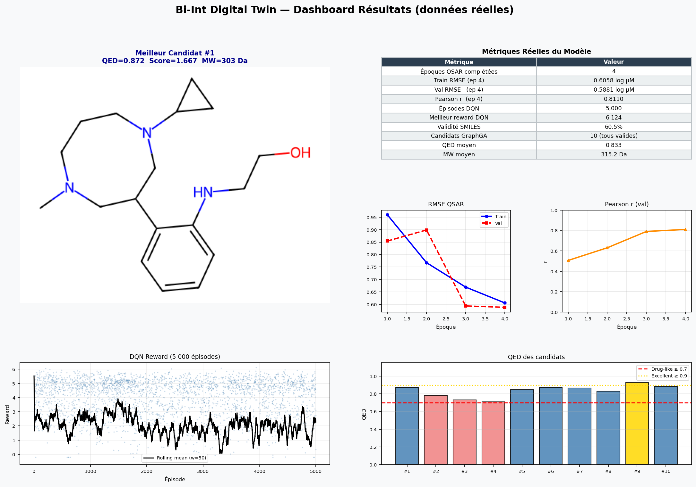
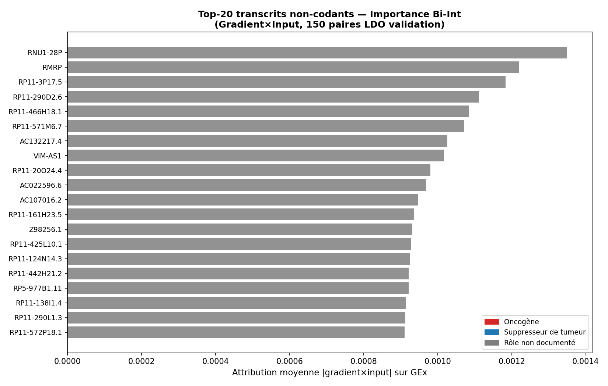
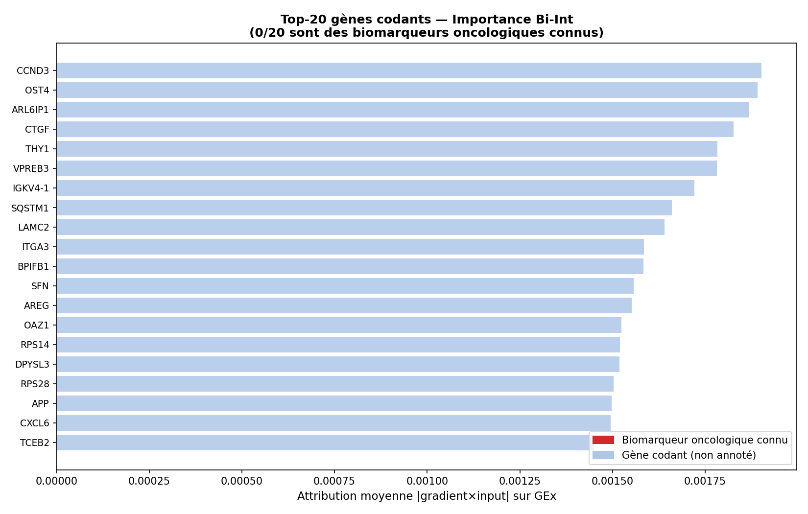
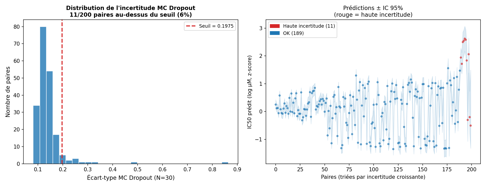
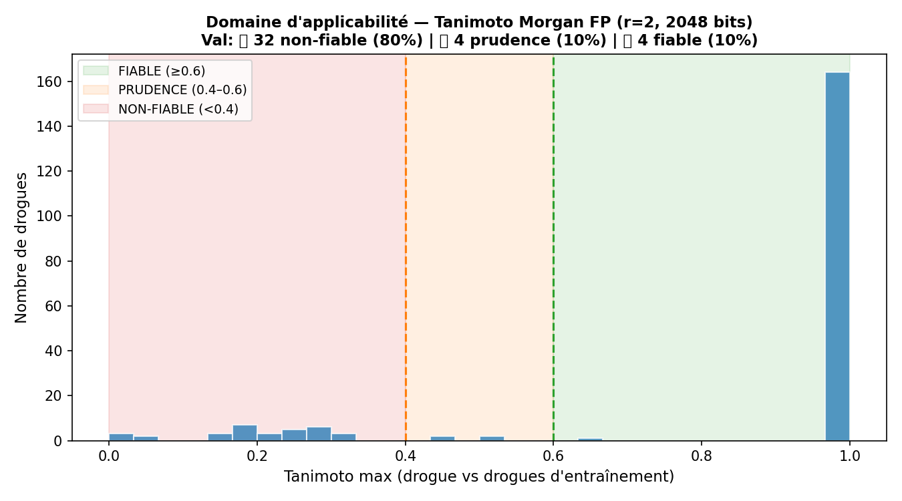

# Twin — Multimodal QSAR + De Novo Drug Generation on CCLE

> Multimodal drug response predictor (QSAR) + de novo molecule generator on CCLE.  
> **This is a research prototype, not a medical-grade digital twin.**

## TL;DR

- Predicts cancer cell-line IC50 from drug SMILES + omics (GEx 978, CNA 426, Mut 735) using a GNN–Quaternion-VAE–Bi-Int fusion model.
- Best honest performance: **Pearson r = 0.316** (leave-drug-out, 95% CI [0.287–0.344]) — weak but statistically significant.
- XGBoost outperforms the deep model on LDO (r = 0.367). Deep learning benefit not yet justified at current data scale.
- Two molecular generators (GraphGA + BRICS-DQN): **38/60 candidates pass all MedChem filters**, internal diversity = **0.90**.
- New (June 2026): model checkpointing, deterministic VAE inference, Gradient×Input biomarker attribution, MC Dropout uncertainty, Tanimoto applicability domain alerts.
- IC50 predictions for generated molecules are **out-of-distribution extrapolations** — do not use as reliable potency estimates.

---

## Key results

### QSAR prediction

| Split | Model | Pearson r | 95% CI | Notes |
|-------|-------|-----------|--------|-------|
| Random | Bi-Int (epoch 4) | **0.811** | [0.736, 0.886] | Optimistic — same drugs in train/val |
| Leave-Drug-Out | **XGBoost** | **0.367** | [0.338, 0.393] | Best model on honest split |
| Leave-Drug-Out | Bi-Int (epoch 2) | 0.316 | [0.287, 0.344] | Deep model, honest metric |
| Leave-Drug-Out | MLP (ECFP4+omics) | 0.349 | — | Classical baseline |
| Leave-Drug-Out | Ridge ECFP4+omics | 0.286 | — | Classical baseline |
| Leave-Cell-Out | Bi-Int (epoch 4) | 0.766 | — | Partial run (6 epochs) |

> Random split r = 0.811 measures interpolation, not generalisation. LDO is the honest metric.

### Molecular generation

| Generator | Candidates | MedChem clean | QED mean | SA mean | Internal diversity |
|-----------|-----------|--------------|---------|---------|-------------------|
| GraphGA | 10 | 10/10 (100%) | 0.833 | 2.76 | — |
| BRICS-DQN (top-50) | 50 | 28/50 (56%) | — | — | — |
| **Combined** | **60** | **38/60 (63%)** | — | — | **0.90** |

### Reliability alerts (June 2026)

| Alert | Method | Result on LDO val set |
|-------|--------|----------------------|
| Applicability domain | Tanimoto vs train drugs (Morgan FP r=2, 2048 bits) | 🔴 80% UNRELIABLE · 🟡 10% CAUTION · 🟢 10% RELIABLE |
| MC Dropout uncertainty | N=30 stochastic passes, dropout=10% | 5.5% HIGH_UNCERTAINTY (σ > 0.198) |

---

## Figures

| | |
|---|---|
|  |  |
| *Fig 02 — Bi-Int training curves (random split, 4 epochs, r=0.811 at epoch 4)* | *Fig 05 — Full results dashboard* |
|  |  |
| *Fig 06 — All candidates Tanimoto < 0.30 vs CCLE drugs — structurally novel* | *Fig 08 — Internal similarity heatmap (60 candidates, diversity = 0.90)* |
|  |  |
| *Fig 09 — ncRNA importance (Gradient×Input, LDO val). H19 rank 61/76, GAS5 rank 70/76* | *Fig 11 — Coding gene importance. 0/20 canonical oncology markers in top-20* |
|  |  |
| *Fig 12 — MC Dropout σ distribution. 5.5% high-uncertainty (dropout=10%, N=30)* | *Fig 13 — 80% of LDO val drugs are out-of-applicability-domain (Tanimoto < 0.4)* |

> Figures 01–08 are in `figures/phase1_training_generation/` and `figures/phase2_validation_ablation/`.  
> Figures 09–13 are in `figures/phase3_interpretability_reliability/`.  
> See [docs/FIGURE_INTERPRETATIONS.md](docs/FIGURE_INTERPRETATIONS.md) for expert-level interpretation of all figures.

---

## Quick Start

```bash
git clone https://github.com/zdorsane/Twin && cd Twin
conda env create -f env.yml && conda activate TwinCell   # or: pip install -r requirements.txt

# Train with best settings (LDO, early stopping, save checkpoint)
python src/fullPipeline.py --mode pretrained --loss-mode cross_entropy \
    --split-mode leave_drug_out --epochs 15 --early-stopping 3 \
    --log-dir logs/my_run --no-ppo --save-model

# Verify checkpoint integrity
python scripts/test_model_loading.py --self-test
python scripts/test_model_loading.py --weights logs/my_run/biint_ic50_model.weights.h5

# Run interpretability and reliability analyses
python scripts/ncrna_biomarker_analysis.py --weights logs/my_run/biint_ic50_model.weights.h5
python scripts/coding_biomarker_analysis.py
python scripts/applicability_domain.py
python scripts/uncertainty_mc_dropout.py --weights logs/my_run/biint_ic50_model.weights.h5
```

---

## Architecture

```
Drug SMILES ──► BRICS graph ──► GNN encoder (ChEMBL pre-trained) ────────────────────┐
                                                                                      │
                                                                   ┌──────────────────┴──────┐
                                                                   │   Bi-Int Blocks (×4)    │
                                                                   │   Row-cross attention   │──► MLP ──► IC50
                                                                   │   Col-cross attention   │
                                                                   │   Triangular updates    │
                                                                   └──────────────────┬──────┘
                                                                                      │
Cell omics ──► Quaternion VAE encoder ────────────────────────────────────────────────┘
  GEx (978 top-variance genes)
  CNA (426 top-variance regions)        latent z (128-d, deterministic at inference)
  Mutations (735 top-mutated genes)

Molecular generation:
  BRICS fragments ──► DQN agent (RL) ──────────┐
                                                ├──► MedChem validation ──► Top candidates
  Population ──► GraphGA (genetic algorithm) ───┘

Reliability layer:
  New query drug ──► Tanimoto vs train drugs ──► 🔴/🟡/🟢 applicability alert
  Forward passes (N=30, dropout ON) ──► MC Dropout uncertainty ──► σ alert
```

---

## Project structure

```
Twin/
├── src/
│   ├── fullPipeline.py              # Bi-Int model, training, checkpointing, all splits
│   ├── chembl_pretrain.py           # GNN pre-training on ChEMBL
│   ├── baseline_models.py           # Ridge, RF, XGBoost, MLP baselines
│   ├── brics_dqn_optimizer.py       # BRICS-DQN molecule generator
│   └── graphga_biint_optimizer.py   # GraphGA molecule generator
│
├── scripts/
│   ├── ncrna_biomarker_analysis.py  # Gradient×Input attribution on ncRNA features
│   ├── coding_biomarker_analysis.py # Gradient×Input attribution on coding genes
│   ├── applicability_domain.py      # Tanimoto-based applicability domain alert
│   ├── uncertainty_mc_dropout.py    # MC Dropout uncertainty (N=30 passes)
│   ├── test_model_loading.py        # Checkpoint save/load integrity test
│   ├── molecular_validation.py      # MedChem: SA, PAINS, Brenk, Lipinski, diversity
│   ├── bootstrap_ci.py              # Bootstrap 95% CI on Pearson r
│   ├── tanimoto_analysis.py         # Tanimoto vs CCLE drugs for generated molecules
│   ├── ldo_ablation.py              # Ablation study: 5 LDO improvement levers
│   ├── final_comparison.py          # Full comparison table (all models × all splits)
│   └── _ccle_loader.py              # Shared CCLE loader using NPZ cache
│
├── notebooks/
│   └── evaluation.ipynb             # Full evaluation: 10 sections, fallback values
│
├── figures/                         # Figures 01–13 (auto-committed PNG)
│
├── Dataset/
│   ├── baseline_results_with_CI.csv            # All baselines × splits × CI
│   ├── ncrna_biomarker_importance.csv           # ncRNA attribution scores
│   ├── coding_biomarker_importance.csv          # Coding gene attribution scores
│   ├── applicability_domain.csv                 # Per-drug Tanimoto + alert
│   ├── uncertainty_mc_dropout.csv               # Per-pair MC uncertainty + alert
│   ├── molecular_validation_report.csv          # 60 candidates × 24 MedChem metrics
│   └── ccle_drug_smiles.csv                     # 201 drugs with SMILES
│
├── docs/
│   ├── FIGURE_INTERPRETATIONS.md    # ★ Expert interpretation of all 13 figures
│   ├── DATA.md                      # CCLE source, dimensions, preprocessing, splits
│   ├── FIGURES_GUIDE.md             # Figure list and regeneration commands
│   ├── TECHNICAL.md                 # Architecture details, hyperparameters
│   └── rapport_31mai2026.md         # Session report 31 May 2026
│
└── reports/
    ├── session_report_2026-06-01.md # Session report 1 June 2026
    └── [other dated reports]
```

---

## Scientific narrative — the negative result that matters

The central finding of this project is a **net negative result on LDO, and it is fully intentional**.

On random split, Bi-Int reaches r = 0.811 — competitive with published CCLE models. On Leave-Drug-Out (the only honest metric), it falls to r = 0.316, **below XGBoost (r = 0.367) and MLP (r = 0.349)**. Most pharmacogenomics papers do not report LDO at all, hiding this exact failure behind inflated random-split numbers.

**What this diagnoses:** ECFP4 fingerprints encode drug *identity*, not structural *similarity*. In LDO regime, when the drug was never seen, fixed fingerprints carry no pharmacological information — they become noise. The GNN encoder, pre-trained on ChEMBL, should recognise pharmacophoric sub-structures even in novel molecules. It does not yet outperform XGBoost at 16k training triplets.

**The decisive test:** with the full 103k triplets + early stopping + L2 regularisation, the ChEMBL-pretrained GNN must beat XGBoost on LDO. If it does, the deep architecture is justified. If it does not, the bottleneck is data scale, not architecture. This is the open question that drives all future work.

---

## Limitations

- **LDO r = 0.316 < XGBoost r = 0.367:** deep learning not yet better than XGBoost at 16k training triplets. Planned: early stopping, L2 regularisation, SMILES augmentation, full 103k dataset.
- **80% of novel drugs are out-of-applicability-domain** (Tanimoto < 0.4): always check applicability domain before trusting any IC50 prediction on a new molecule.
- **MC Dropout underestimates uncertainty** (5.5% flagged at 10% dropout): combine with Tanimoto alert — a model can be confident and wrong simultaneously when extrapolating.
- **Biomarker attributions computed on LDO checkpoint (r=0.210):** canonical oncology markers (EGFR, KRAS, TP53) not yet in top-20. To be recomputed on random checkpoint (r=0.811).
- **65/266 drugs without SMILES:** excluded from all molecular analyses.
- **BRICS-DQN validity ~60%:** one in two generated molecules chemically invalid. Valence penalty next improvement.
- **20k subsampled training set:** full CCLE has 103k triplets; RAM/GPU constraints apply.

---

## Data

See [docs/DATA.md](docs/DATA.md). Large files (>100 MB) are gitignored — download from [DepMap portal](https://depmap.org/portal/download/).

---

## Citation + License + Contact

- Research prototype. MIT License — see [LICENSE](LICENSE).
- CCLE dataset: Barretina et al., *Nature* 2012.
- Contact / issues: https://github.com/zdorsane/Twin/issues
