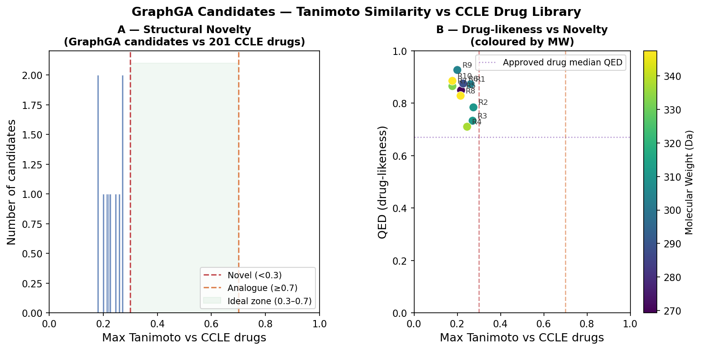
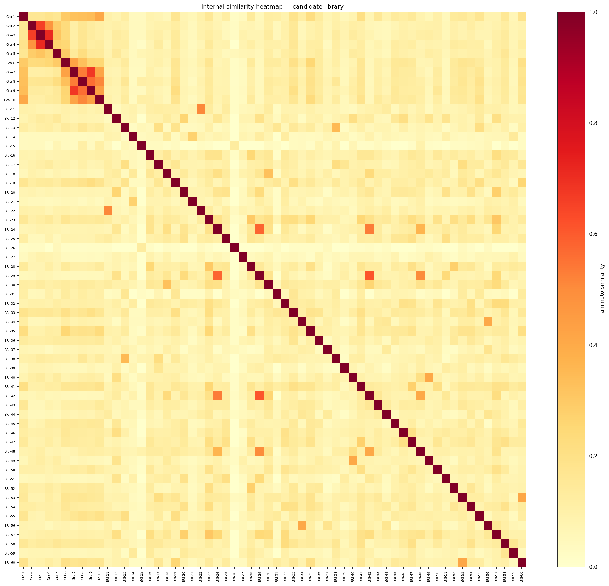

# Twin — Multimodal QSAR + De Novo Drug Generation on CCLE

> Multimodal drug response predictor (QSAR) + de novo molecule generator on CCLE.
> **This is a research prototype, not a medical-grade digital twin.**

## TL;DR

- Predicts cancer cell-line IC50 from drug SMILES + omics (GEx, CNA, mutations) using a GNN–VAE fusion model (Bi-Int).
- Best honest performance: **Pearson r = 0.316** (leave-drug-out) — weak but statistically significant (p << 0.001).
- XGBoost outperforms the deep model on LDO (r = 0.367). Deep learning benefit not yet justified at this data scale.
- Two molecular generators (GraphGA + BRICS-DQN) produced 60 drug-like candidates; **38/60 pass all MedChem filters**, internal library diversity = **0.90**.
- IC50 values predicted for generated molecules are **extrapolated out-of-distribution** and must not be taken as reliable potency estimates.

---

## Key results

| Split | Model | Pearson r | 95% CI |
|-------|-------|-----------|--------|
| Random | Bi-Int (epoch 4) | **0.811** | [0.736, 0.886] |
| Leave-Drug-Out | **XGBoost** | **0.367** | [0.338, 0.393] |
| Leave-Drug-Out | Bi-Int (epoch 2) | 0.316 | [0.287, 0.344] |
| Leave-Drug-Out | MLP (256→128) | 0.225 | [0.194, 0.255] |
| Leave-Drug-Out | Ridge ECFP4+omics | 0.228 | [0.196, 0.256] |
| Leave-Cell-Out | XGBoost | 0.824 | — |

> Random split r = 0.811 is inflated (same drugs in train and test). LDO is the honest metric.

---

## Figures

| | |
|---|---|
|  |  |
| *Fig 1 — Bi-Int training curves (random split, 4 epochs)* | *Fig 2 — Full results dashboard* |
|  |  |
| *Fig 3 — Tanimoto similarity vs CCLE drugs (GraphGA candidates)* | *Fig 4 — QED / MW / LogP for GraphGA top-10* |
|  | |
| *Fig 5 — Internal similarity heatmap (60 candidates, diversity = 0.90)* | |

See [docs/FIGURES_GUIDE.md](docs/FIGURES_GUIDE.md) for all figures and regeneration instructions.

---

## Quick Start

```bash
git clone https://github.com/zdorsane/Twin && cd Twin
conda env create -f env.yml && conda activate TwinCell   # or: pip install -r requirements.txt
python src/fullPipeline.py --loss-mode cross_entropy --split-mode random --epochs 5
```

---

## Architecture

```
Drug SMILES ──► BRICS graph ──► GNN encoder ──────────────────────────────────┐
                                                                               ├──► Bi-Int fusion ──► MLP ──► IC50
Cell omics (GEx 978 + CNA 426 + Mut 735) ──► Quaternion VAE encoder ──────────┘

Molecular generation:
  BRICS fragments ──► DQN agent ──────────────────────────────────────────────┐
                                                                               ├──► Top candidates ──► MedChem validation
  Population of molecules ──► Genetic Algorithm (GraphGA) ────────────────────┘
```

---

## Project structure

```
Twin/
├── README.md                        # This file
├── LICENSE                          # MIT
├── requirements.txt                 # Python dependencies
├── env.yml                          # Conda environment
│
├── src/                             # Core model & generation code
│   ├── fullPipeline.py              # Bi-Int model, training, splits
│   ├── chembl_pretrain.py           # GNN pre-training on ChEMBL
│   ├── baseline_models.py           # Ridge, RF, XGBoost, MLP baselines
│   ├── brics_dqn_optimizer.py       # BRICS-DQN molecule generator
│   └── graphga_biint_optimizer.py   # GraphGA molecule generator
│
├── scripts/                         # Utility & analysis scripts
│   ├── molecular_validation.py      # MedChem validation (SA, PAINS, Brenk, Tanimoto)
│   ├── tanimoto_analysis.py         # Tanimoto vs CCLE drugs
│   ├── bootstrap_ci.py              # Bootstrap 95% CI on Pearson r
│   ├── ldo_ablation.py              # Ablation study: 5 LDO improvement levers
│   └── smiles_augmentation.py       # Random SMILES enumeration (data augmentation)
│
├── notebooks/
│   └── evaluation.ipynb             # Full evaluation: results, figures, analysis
│
├── figures/                         # All PNG figures (auto-committed)
│
├── Dataset/                         # Small CSVs only (large files gitignored)
│   ├── baseline_results_with_CI.csv
│   ├── graphga_tanimoto_vs_ccle.csv
│   ├── molecular_validation_report.csv
│   └── ccle_drug_smiles.csv
│
├── docs/
│   ├── DATA.md                      # CCLE source, dimensions, preprocessing, splits
│   ├── FIGURES_GUIDE.md             # What each figure shows and how to regenerate
│   ├── TECHNICAL.md                 # Architecture details, hyperparameters
│   ├── DQN_HISTORY.md               # DQN version history v1→v5.1
│   └── rapport_31mai2026.md         # Session report 31 May 2026 (expert-level)
│
└── reports/                         # Dated session reports
```

---

## Limitations

- **LDO r = 0.316:** statistically significant but weak. Generated-molecule IC50 predictions are unreliable for novel structures.
- **XGBoost outperforms Bi-Int on LDO:** deep learning adds no benefit yet at 16k training triplets. Planned fixes: early stopping, stronger regularisation, SMILES augmentation, full 100k dataset.
- **20k subsampled training set:** full CCLE has 103k triplets; RAM/GPU constraints limit current runs.
- **65 drugs without SMILES:** 24% of CCLE drugs are excluded from training due to incomplete PubChem mapping.
- **BRICS-DQN validity ~60%:** one in two generated molecules is chemically invalid. Reward-function valence penalties are the next step.
- **SA score is a heuristic:** actual synthetic difficulty should be verified with retrosynthesis tools (AiZynthFinder, ASKCOS).
- **Tanimoto < 0.35 for all 60 candidates vs CCLE drugs:** high novelty = high ADMET uncertainty. In silico ADMET (SwissADME, pkCSM) recommended before any wet-lab work.

---

## Data

See [docs/DATA.md](docs/DATA.md) for full description of CCLE source, preprocessing, and splits.

Large dataset files (>100 MB) are gitignored. Download from [DepMap portal](https://depmap.org/portal/download/).

---

## Citation + License + Contact

- Research prototype. MIT License — see [LICENSE](LICENSE).
- If you use this code, please cite the CCLE paper: Barretina et al., *Nature* 2012.
- Contact / issues: https://github.com/zdorsane/Twin/issues
